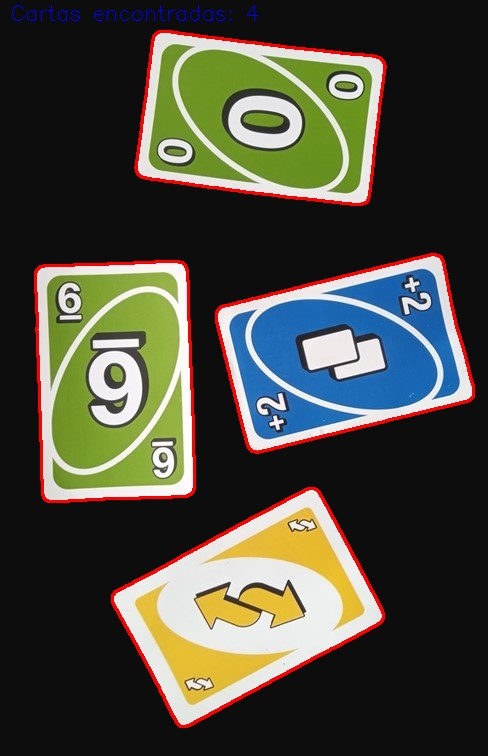
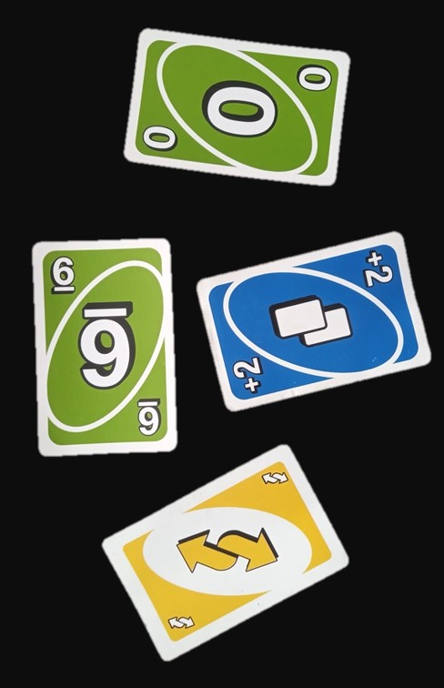

<p align="center">
  
  <h2 align="center">Miguel Angel Diaz</h2>
</p>

# CONTADOR DE CARTAS 🎴
```es```
Un mini proyecto para contar cartas
```en```
A small project for count carts

<hr/>

```es```
Este es el resultado de nuestra imagen:
```en```
This is the result of the image



```es```
la imagen paso por diferentes procesos, peudes verlo en el codigo, la imagen original se veia algo asi:
(tu imagen debe ser de un fondo uniforme, que no tenga colores parecidos a la carta)

```en```
The image went through different processes, you can see it in the code, the original image looked something like this:
(your image must be of a uniform background, which does not have colors similar to the letter)



> [!NOTE]
> ```en```
> Remember to have OpenCV installed in your virtual env
> ```es```
> Recuerda tener instalado tu entorno virtual OpenCV
> 

```es```
Primero, crear un entorno virtual:
```en```
First, create a virtual env
```python
pip install virtualenv
```

```python
virtualenv env
```

```es```
Luego activarlo y correr el script en tu consola:
```en```
Then activate it and run the script on your console:
```python
env/Scripts/activate
```

```es```
Instala OpenCV:
```en```
Install OpenCV:
```python
pip install opencv-python
```

<hr/>

<br/>

# 🌍🌞🌃✨ Por si deseas contactarme 👨‍💻 :

[](https://www.linkedin.com/in/miguel-angel-diaz-858379297/)
<br/>
[](https://www.youtube.com/channel/UC7TggInDtfL8HXmFeVtvSIg)
<br/>
[](https://twitter.com/titooo159)
<br/>
[](https://www.instagram.com/titoo.uvu/)
<br/>
[](#)
<br/>
[](mailto:miguelitodiaz169@gmail.com)
